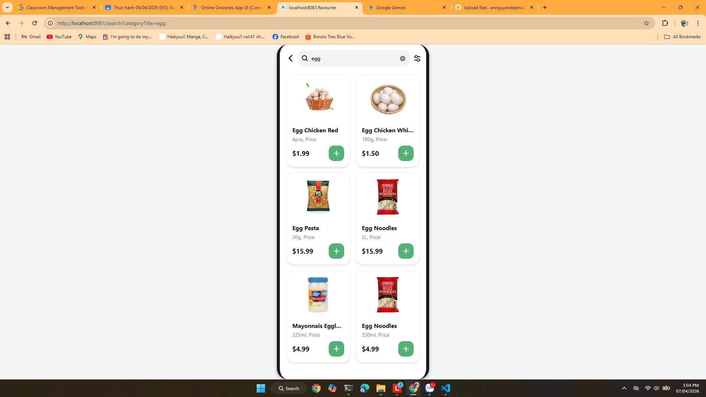
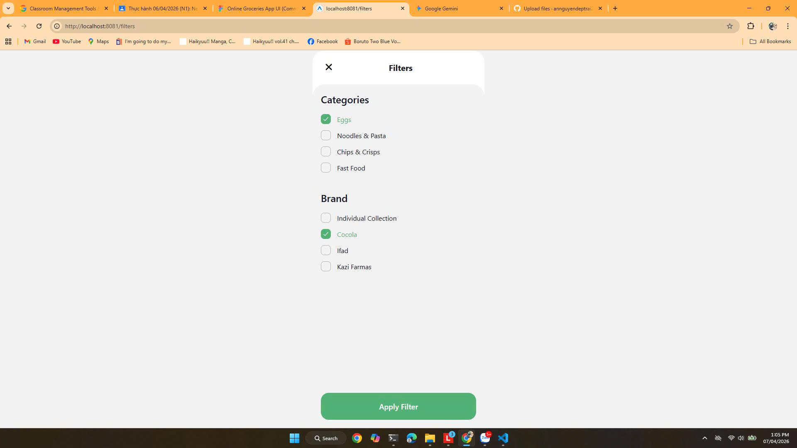
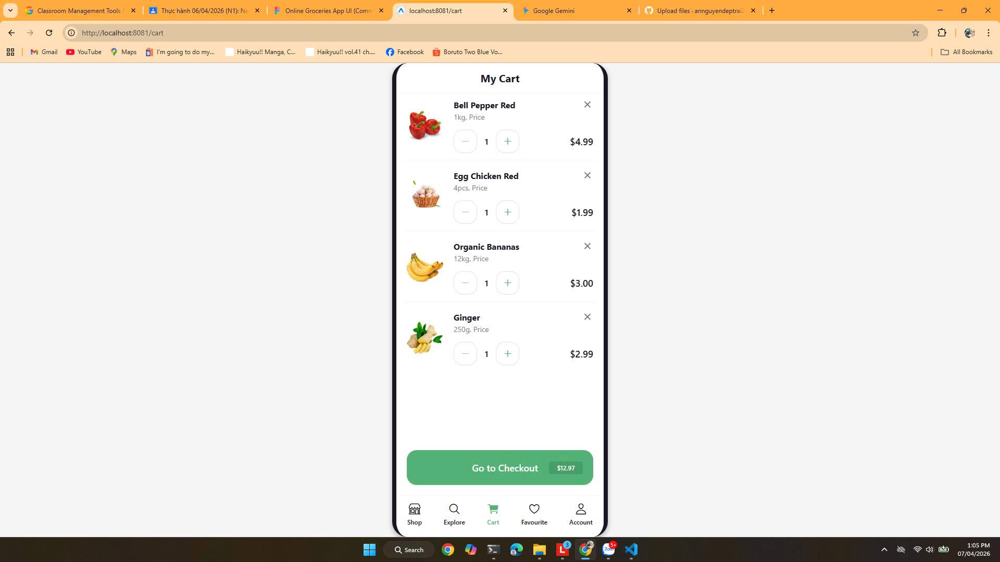
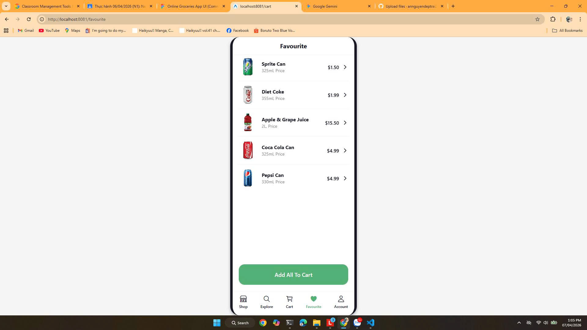

# Thực hành sử dụng Components - React Native

## Thông tin sinh viên
- Họ và tên: Nguyễn Văn An
- Mã sinh viên: 23810310355

## Mô tả bài tập
Nâng cấp bài tập validation số điện thoại, thêm màn hình HomeScreen (Trang chủ).
Sau khi người dụng nhập số điện thoại hợp lệ thì chuyển sang màn hình Home.

## Hình ảnh kết quả chạy ứng dụng

